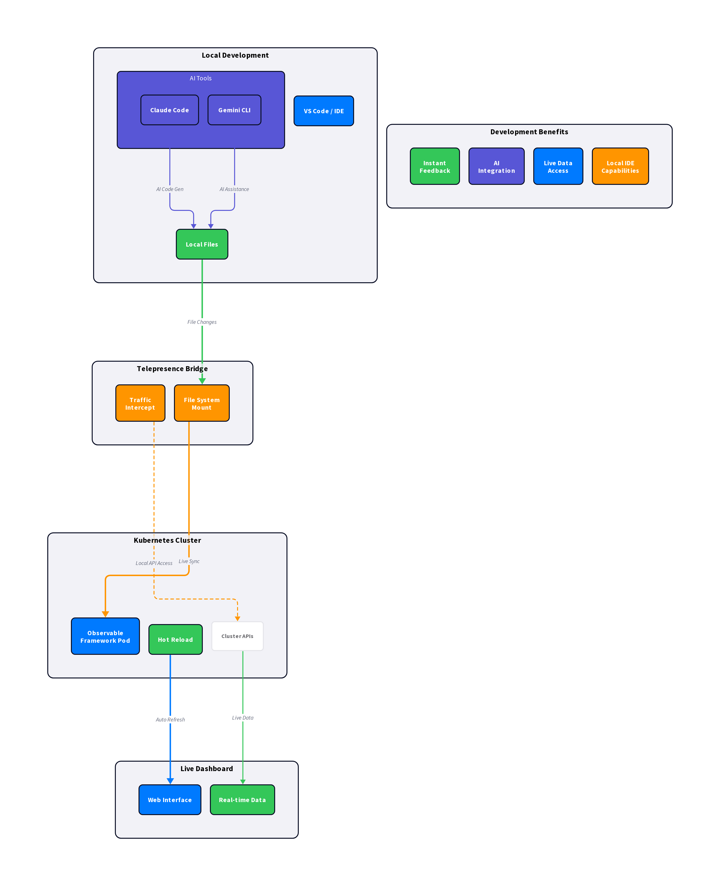
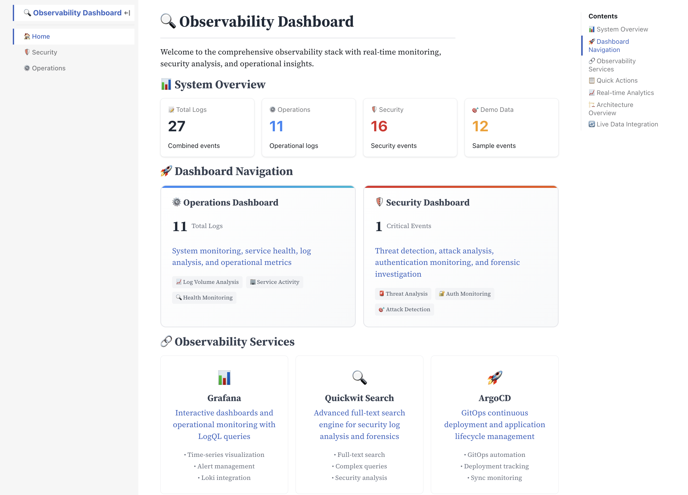
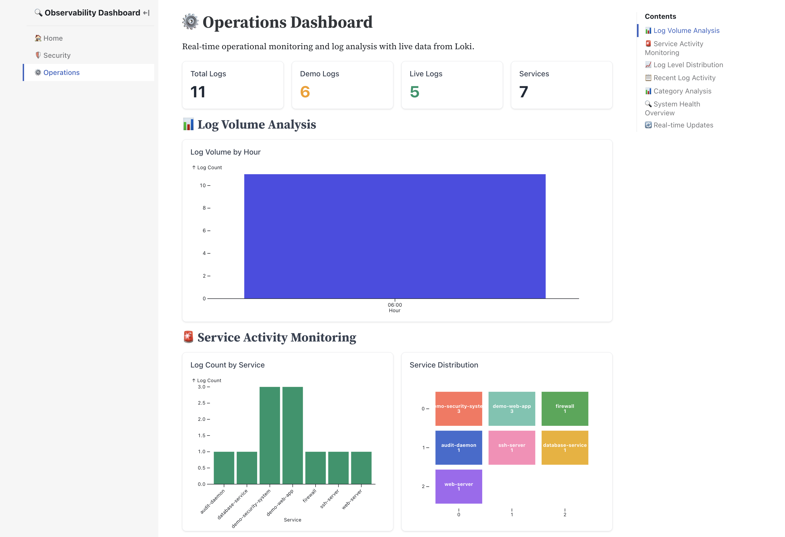
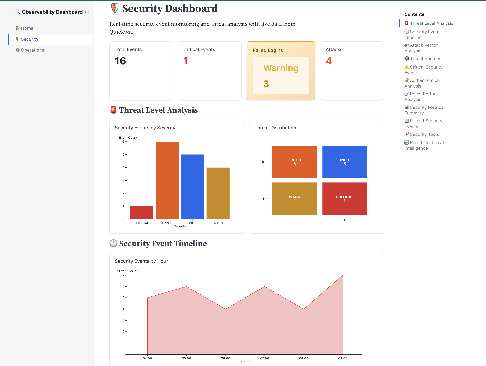
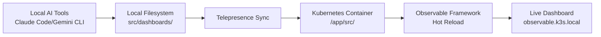
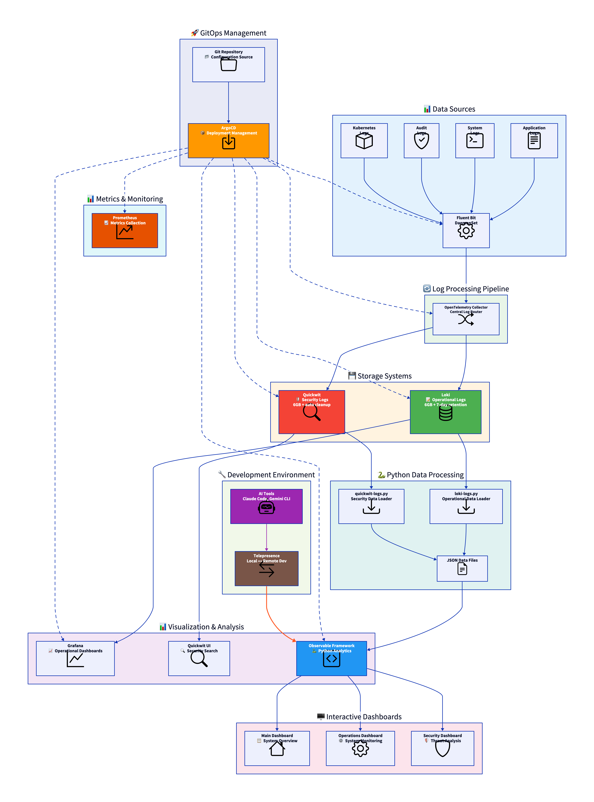
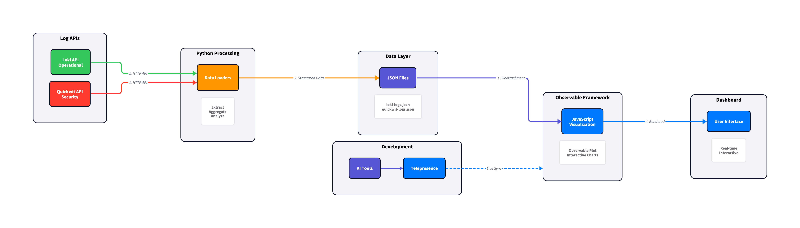
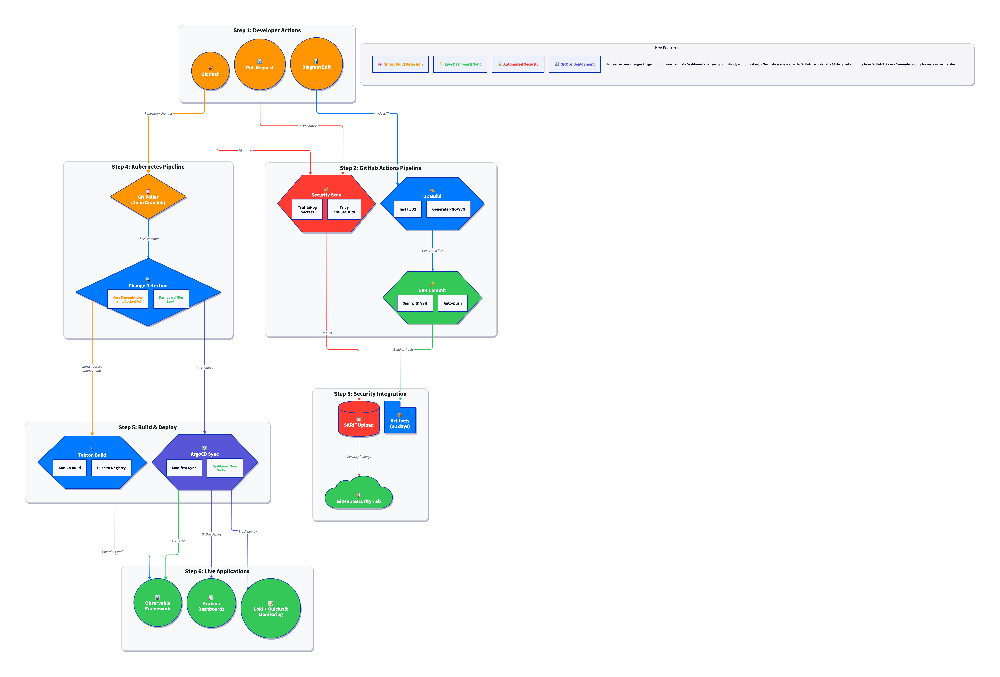

# Observability k8s - speedy insights

**Rapid dashboard development with Kubernetes, GitOps and AI-powered tools**



**🎬 Interactive Animation Demo: `mydocs/animated-workflow.html`**
*Open locally to see the AI + Telepresence + Kubernetes workflow in action*

## 🚀 Quick Start: Live Development

Experience **true cloud-native development** - edit locally with your favorite AI tools while running against live Kubernetes data.

### **Core Concept: Mount-and-Develop**
```bash
# 1. Mount Observable container filesystem locally via Telepresence
./scripts/telepresence-observable-connect.sh intercept

# 2. Edit files locally with Claude Code, Gemini CLI, or any IDE
code src/security.md  # Your changes sync automatically

# 3. Test against live Kubernetes data instantly
curl http://localhost:3000/security  # See your changes immediately
```

**🎯 Perfect for**: Dashboard development, data analysis, real-time debugging with production-like data

---

## 📊 Dashboard Gallery

Experience **Python data processing** with **Interactive JavaScript visualizations** running on live Kubernetes data.

<div align="center">

### 🏠 [Main Dashboard](docs/dashboards.md#main-dashboard) - System Overview
[](screenshots/home.png)
*Real-time system health, service links, and comprehensive metrics overview*

### ⚙️ [Operations Dashboard](docs/dashboards.md#operations-dashboard) - System Monitoring  
[](screenshots/operations.png)
*Log volume analysis, service activity monitoring, and operational health insights*

### 🛡️ [Security Dashboard](docs/dashboards.md#security-dashboard) - Threat Analysis
[](screenshots/security.png)
*Security event monitoring, threat detection, and forensic investigation tools*

</div>

## 📋 Table of Contents

### **🚀 Development Workflows**
1. [🎬 Interactive Animation Demo](mydocs/animated-workflow.html) - **See the workflow in action**
2. [Live Development Setup](#live-development-setup) - **Start here for hands-on development**
3. [Telepresence Integration](#telepresence-integration) - **Mount remote containers locally**
4. [AI Tools Integration](#ai-tools-integration) - **Claude Code + Gemini CLI workflows**
5. [File Mounting Strategies](#file-mounting-strategies) - **Local ↔ Remote file sync**

### **🏗️ Architecture & Deployment**
6. [System Architecture](#system-architecture) - **Understanding the stack**
7. [Architecture Documentation](docs/architecture.md) - **Complete system design**
8. [GitHub Actions SSH Signing](docs/github-actions-ssh-signing.md) - **Automated workflow setup**

### **📊 Data & APIs**
9. [API Endpoints](docs/api-endpoints.md) - **Testing and development**
10. [Complete Setup Guide](docs/setup.md) - **Full deployment instructions**

### **📖 Documentation**
11. [Example Usage](docs/examples.md) - **Step-by-step tutorials**

---

## 🚀 Live Development Setup

### **Prerequisites**
- **Kubernetes cluster** (tested with k3s, kind)
- **Telepresence** installed locally
- **AI tools**: Claude Code, Gemini CLI, or your preferred editor

### **1. Quick Cluster Setup**
```bash
# Configure cluster IP
vi config/cluster-config.env  # Set your cluster IP

# Bootstrap entire stack
./scripts/bootstrap-gitops.sh
```

### **2. Start Live Development**
```bash
# Method 1: Telepresence Intercept (Recommended)
./scripts/telepresence-observable-connect.sh intercept
# ✅ Routes cluster traffic to your local machine
# ✅ Mount remote filesystem locally
# ✅ Edit with any local tool

# Method 2: Direct Container Access
./scripts/observable-dashboard-manager.sh quick-edit index.md
# ✅ Direct file editing in container
# ✅ Hot reload on save
```

### **3. AI-Powered Development**
```bash
# Option A: Claude Code integration
code .  # Open project in VS Code with Claude Code extension
# Edit files locally, changes sync to cluster automatically

# Option B: Gemini CLI integration  
gemini chat "Help me create a security dashboard showing failed login attempts"
# Use AI suggestions, implement in local files
```

## 🔗 Telepresence Integration

### **Advanced Development Workflows**

#### **Traffic Interception**
```bash
# Intercept all Observable Framework traffic
./scripts/telepresence-observable-connect.sh intercept

# Now your local development server handles cluster requests
npm run dev  # Your local changes serve cluster traffic
```

#### **File System Mounting**
```bash
# Mount remote container filesystem locally
./scripts/telepresence-observable-connect.sh local-dev

# Remote files appear in local filesystem
ls -la /app/src/  # See container files locally
```

#### **Live Sync Workflows**
```bash
# Continuous sync mode
./scripts/telepresence-observable-connect.sh sync

# Edit locally ← AI tools integration
code src/security.md

# Changes appear in cluster immediately
curl http://observable.k3s.local/security
```

### **Benefits of Telepresence Development**
- ✅ **True local development** with cluster data
- ✅ **AI tool integration** - use Claude Code, Gemini CLI locally
- ✅ **Instant feedback** - see changes immediately
- ✅ **Production-like environment** - real Kubernetes data
- ✅ **Network access** - local tools can call cluster APIs

## 🤖 AI Tools Integration

### **Using Claude Code**
```bash
# 1. Start Telepresence intercept
./scripts/telepresence-observable-connect.sh intercept

# 2. Open project with Claude Code
code .

# 3. Edit files with AI assistance
# Claude Code can:
# - Analyze live log data from cluster APIs
# - Generate Observable Plot visualizations
# - Create Python data loaders
# - Build markdown dashboards
```

### **Using Gemini CLI**
```bash
# 1. Mount filesystem locally
./scripts/telepresence-observable-connect.sh local-dev

# 2. Use Gemini for development assistance
gemini chat "Create a Python script to analyze Quickwit security logs"

# 3. Implement suggestions in mounted files
# Changes sync automatically to cluster
```

### **File Mounting + AI Workflow**


## 💾 File Mounting Strategies

### **Strategy 1: Telepresence Volume Mount**
```bash
# Best for: Full-featured development with AI tools
./scripts/telepresence-observable-connect.sh intercept

# Local filesystem mirrors remote container
/local/project/src/ ↔ /app/src/ (in container)
```

### **Strategy 2: kubectl cp + Watch**
```bash
# Best for: Quick edits and testing
./scripts/observable-dashboard-manager.sh upload-file dashboard.md

# Watch for changes and auto-sync
fswatch -o src/ | xargs -n1 ./scripts/sync-to-cluster.sh
```

### **Strategy 3: Direct Container Development**
```bash
# Best for: Container-native development
kubectl exec -it observable-pod -- /bin/bash

# Use container tools directly
conda activate observable
python src/data/loki-logs.py
```

## 🏗️ System Architecture

### **Complete System Overview**

*Complete observability stack with GitOps, data processing, and development environment*

### **Data Flow Architecture** 

*Python + JavaScript hybrid architecture for real-time analytics*

### **AI-Powered Development Workflow**

*Telepresence integration with Claude Code and Gemini CLI for live development*

### **CI/CD Pipeline**

*Automated security scanning and deployment pipeline*

### **Core Stack Components**
- **🐍 Python Data Processing** - Real-time API integration with Loki/Quickwit
- **📊 Observable Framework** - Interactive JavaScript visualizations
- **🔄 Live Development** - Telepresence-powered local development
- **🛡️ Security Focus** - Dedicated security log analysis and threat detection
- **⚙️ Operations Monitoring** - System health and performance dashboards

### **Development Environment Features**
- **Live Data Integration** - Real Kubernetes log data
- **AI Tool Support** - Claude Code, Gemini CLI integration
- **Hot Reload** - Instant dashboard updates
- **Remote Debugging** - Local tools with cluster data access
- **GitOps Deployment** - Automated infrastructure management

[All D2 diagrams →](mydocs/) | [Complete architecture documentation →](docs/architecture.md)

## 🎯 Key Development Scenarios

### **Scenario 1: Security Dashboard Development**
```bash
# 1. Start development environment
./scripts/telepresence-observable-connect.sh intercept

# 2. Create security dashboard with AI assistance
claude-code create src/security-advanced.md
# AI helps analyze Quickwit data and create visualizations

# 3. Test with live data
curl http://localhost:3000/security-advanced
```

### **Scenario 2: Custom Data Loader Development**
```bash
# 1. Mount container filesystem
./scripts/telepresence-observable-connect.sh local-dev

# 2. Develop Python loader locally
gemini chat "Help me create a data loader for authentication events"
# Edit src/data/auth-events.py locally

# 3. Test against cluster APIs
python src/data/auth-events.py  # Accesses live Quickwit API
```

### **Scenario 3: Real-time Dashboard Debugging**
```bash
# 1. Intercept traffic for debugging
./scripts/telepresence-observable-connect.sh intercept

# 2. Debug with local tools
npm run dev -- --inspect  # Node.js debugging
# OR
python -m pdb src/data/loki-logs.py  # Python debugging

# 3. See results immediately in cluster
```

## 🔧 Development Tools Available

### **Container Environment**
- **Python 3.12+** with conda environment
- **Node.js** with Observable Framework
- **Git** for version control
- **curl/wget** for API testing
- **Standard Unix tools** (vi, nano, bash)

### **Local Integration**
- **Claude Code** - AI-powered development
- **Gemini CLI** - Command-line AI assistance  
- **VS Code** - Full IDE support via Telepresence
- **Your favorite tools** - Any local editor works

### **APIs Accessible in Development**
- **Loki API**: `http://loki.k3s.local:3100` - Operational logs
- **Quickwit API**: `http://quickwit.k3s.local:7280` - Security logs
- **Prometheus**: `http://prometheus.k3s.local:9090` - Metrics
- **Observable Framework**: `http://observable.k3s.local` - Dashboard serving

## 📖 Next Steps

1. **[Start developing →](docs/setup.md)** - Complete setup and first dashboard
2. **[View examples →](docs/examples.md)** - Step-by-step tutorials  
3. **[Explore APIs →](docs/api-endpoints.md)** - Data sources and integration
4. **[Learn GitOps →](docs/gitops.md)** - Automated deployment workflows

---

**🎯 This environment provides the perfect blend of local development flexibility with production-like Kubernetes data access. Start developing immediately with your preferred AI tools while leveraging live cluster data!**
