# GitOps Observability Stack

Complete observability stack managed by ArgoCD for learning GitOps principles with dual log routing: operational logs to Loki and security logs to Quickwit.

## Table of Contents

1. [Overview & Architecture](#overview--architecture)
2. [System Architecture Diagram](#system-architecture-diagram)
3. [Python Data Loaders & Observable Integration](#python-data-loaders--observable-integration)
4. [Prerequisites](#prerequisites)
5. [Quick Start](#quick-start)
6. [GitOps Workflow](#gitops-workflow)
7. [Access Points](#access-points)
8. [Dashboard Development](#dashboard-development-workflow-simplified)
9. [Log Routing & Data Processing](#log-routing--data-processing)
10. [Testing the Log Pipeline](#testing-the-log-pipeline)
11. [Search API Endpoints](#search-api-endpoints)
12. [Cluster Configuration](#cluster-configuration)
13. [📋 Example Usage Guide](Example-Usage.md) - **Complete demo and development workflow**

## Overview & Architecture

This observability stack implements a **dual-pipeline log routing architecture** with 8 main components:

### **Core Services**
- **Vector** - Log collection (DaemonSet + client installations)
- **OpenTelemetry Collector** - Central log routing hub
- **Loki** - Time-series log storage for operational monitoring
- **Quickwit** - Full-text search engine for security analysis
- **Grafana** - Dashboards and operational log analysis
- **Prometheus** - Metrics collection and monitoring
- **Observable Framework** - Python-powered data analysis and markdown reports
- **ArgoCD** - GitOps automation and deployment management

## System Architecture Diagram

```mermaid
graph TB
    %% Data Sources
    subgraph "📊 Data Sources"
        VS[Vector DaemonSet]
        VC[Vector Clients]
        AL[Application Logs]
        SL[System Logs]
        AU[Audit Logs]
    end

    %% Log Collection & Routing
    subgraph "🔄 Log Processing Pipeline"
        OTEL[OpenTelemetry Collector<br/>Central Log Router]
    end

    %% Storage Systems
    subgraph "💾 Storage Systems"
        LOKI[Loki<br/>📝 Operational Logs<br/>6GB + 7-day retention]
        QW[Quickwit<br/>🛡️ Security Logs<br/>6GB + auto cleanup]
    end

    %% Analysis & Visualization
    subgraph "📊 Visualization & Analysis"
        GRAF[Grafana<br/>📈 Operational Dashboards]
        QWUI[Quickwit UI<br/>🔍 Security Search]
        OBS[Observable Framework<br/>🐍 Python Analytics]
    end

    %% Data Analytics
    subgraph "🐍 Python Data Processing"
        LL[loki-logs.py<br/>Operational Data Loader]
        QL[quickwit-logs.py<br/>Security Data Loader] 
        JSON[JSON Data Files]
    end

    %% Interactive Dashboards
    subgraph "🖥️ Interactive Dashboards"
        MAIN[Main Dashboard<br/>📋 System Overview]
        OPSD[Operations Dashboard<br/>⚙️ System Monitoring]
        SECD[Security Dashboard<br/>🛡️ Threat Analysis]
    end

    %% GitOps Management
    subgraph "🚀 GitOps Management"
        ARGO[ArgoCD<br/>📦 Deployment Management]
        GIT[Git Repository<br/>📂 Configuration Source]
    end

    %% Monitoring
    subgraph "📊 Metrics & Monitoring"
        PROM[Prometheus<br/>📈 Metrics Collection]
    end

    %% Data Flow
    VS --> OTEL
    VC --> OTEL
    AL --> VS
    SL --> VS
    AU --> VS

    OTEL --> LOKI
    OTEL --> QW

    LOKI --> GRAF
    LOKI --> LL
    QW --> QWUI
    QW --> QL

    LL --> JSON
    QL --> JSON
    JSON --> OBS

    OBS --> MAIN
    OBS --> OPSD
    OBS --> SECD

    %% GitOps Flow
    GIT --> ARGO
    ARGO -.-> LOKI
    ARGO -.-> QW
    ARGO -.-> GRAF
    ARGO -.-> OBS
    ARGO -.-> PROM
    ARGO -.-> OTEL

    %% Styling
    classDef storage fill:#e1f5fe
    classDef analysis fill:#f3e5f5
    classDef processing fill:#e8f5e8
    classDef gitops fill:#fff3e0
    classDef dashboards fill:#fce4ec

    class LOKI,QW storage
    class GRAF,QWUI,OBS analysis
    class OTEL,LL,QL,JSON processing
    class ARGO,GIT gitops
    class MAIN,OPSD,SECD dashboards
```



## Python Data Loaders & Observable Integration

This observability stack features a unique **hybrid architecture** that combines **Python data processing** with **JavaScript visualization** to create powerful, real-time analytics dashboards.

### **🐍 Python Data Processing Layer**

**Purpose**: Extract, transform, and analyze log data from APIs before visualization

#### **Loki Data Loader (`loki-logs.py`)**
```python
# Fetches operational logs from Loki API
# Processes time-series data, service metrics, health scores
# Outputs structured JSON for Observable Framework
```

**Key Features**:
- **API Integration**: Direct queries to Loki's LogQL API
- **Data Aggregation**: Groups logs by service, time, level, category
- **Health Metrics**: Calculates system health scores and operational insights
- **Demo Detection**: Distinguishes demo data from live production logs

#### **Quickwit Data Loader (`quickwit-logs.py`)**
```python
# Fetches security logs from Quickwit search API
# Analyzes threat patterns, authentication events, attacks
# Provides security intelligence and risk assessment
```

**Key Features**:
- **Security Analytics**: Threat detection, risk scoring, attack vector analysis
- **Authentication Monitoring**: Failed login tracking, account security events
- **Forensic Data**: Detailed event logs for security investigations
- **Real-time Intelligence**: Live threat source identification and categorization

### **🔄 Data Flow Architecture**


### **🎯 Why This Hybrid Approach?**

**Python Strengths**:
- **Data Processing**: Advanced analytics, aggregation, statistical analysis
- **API Integration**: Robust HTTP clients, error handling, data transformation
- **Scientific Computing**: pandas, numpy for complex data operations
- **Flexibility**: Easy to extend with ML models, custom algorithms

**Observable Framework Strengths**:
- **Visualization**: Interactive charts, responsive design, real-time updates
- **Web Performance**: Fast rendering, optimized JavaScript execution
- **User Experience**: Smooth interactions, progressive loading
- **Markdown Integration**: Narrative dashboards with embedded visualizations

### **🔧 Development Workflow**

1. **Data Loader Development**:
   ```bash
   # Test Python loaders locally
   kubectl exec -it -n observable <pod> -- bash
   conda activate observable
   python /app/src/data/loki-logs.py > loki-logs.json
   ```

2. **Dashboard Development**:
   ```bash
   # Copy updated dashboards
   kubectl cp security.md observable/<pod>:/app/src/security.md
   # Observable Framework auto-reloads with new data
   ```

3. **Live Development**:
   - Python loaders run every few minutes (or on-demand)
   - Observable Framework serves updated dashboards instantly
   - Real-time data flows from APIs → Python → JSON → JavaScript → Browser

### **📊 Observable Framework Integration**

**Data Loading Pattern**:
```javascript
// Load processed data from Python loaders
const operationalData = FileAttachment("data/loki-logs.json").json();
const securityData = FileAttachment("data/quickwit-logs.json").json();

// JavaScript processes the pre-aggregated data
const chartData = operationalData.summary.by_hour;
const riskScore = securityData.summary.risk_assessment;
```

**Visualization Benefits**:
- **Pre-processed Data**: Python handles heavy analytics, JavaScript focuses on visualization
- **Optimized Performance**: Structured JSON enables fast chart rendering
- **Real-time Updates**: File changes trigger automatic dashboard refreshes
- **Interactive Features**: Observable Plot provides rich user interactions

This architecture provides the **best of both worlds**: Python's data processing power combined with JavaScript's visualization capabilities, resulting in fast, interactive, and analytically sophisticated observability dashboards.

### **🔨 Container Build Process (Tekton Integration)**

**Important**: The Observable Framework container requires a **build process** when first deployed or when major updates are made to the conda environment or dependencies.

**Build Process**:
1. **Tekton Pipeline**: Automatically triggered by ArgoCD deployment changes
2. **Container Setup**: 
   - Node.js and npm installation (30-60 seconds)
   - Conda environment creation with data science packages (2-5 minutes)
   - Observable Framework installation and startup (10-30 seconds)
3. **Total Build Time**: 3-7 minutes for complete environment setup

**Monitoring Build Status**:
```bash
# Check build logs and progress
kubectl logs -n observable <pod-name> -f

# Monitor build phases
kubectl get pods -n observable -w
```

**Build Completion Indicators**:
- ✅ Node.js and npm versions displayed
- ✅ Conda environment "observable" created
- ✅ Observable Framework listening on port 3000
- ✅ Dashboard accessible at http://observable.k3s.local

The build process is **automated** and **only required** during initial deployment or major dependency updates. Normal dashboard development using `kubectl cp` does not trigger rebuilds.

### **Data Retention & Storage**
- **Loki**: 6GB persistent storage with 7-day retention policy
- **Quickwit**: 6GB persistent storage with automatic cleanup
- **Grafana**: Persistent storage (1Gi PVC) - data survives pod restarts
- **Prometheus**: Persistent storage for metrics collection
- **Observable Framework**: Live development with volume-based storage

## Prerequisites

- **Kubernetes cluster** (tested with k3s)
- **kubectl** configured for your cluster
- **Git** for GitOps workflow
- **curl** for testing API endpoints
- **Ingress controller** for web interface access (*.k3s.local domains)

## Quick Start

1. **Configure cluster IP for your environment:**
   ```bash
   # Edit config/cluster-config.env and set your cluster IP
   vi config/cluster-config.env
   
   # Configure Vector client
   ./scripts/configure-vector.sh
   ```

2. **Bootstrap ArgoCD and the stack:**
   ```bash
   chmod +x scripts/bootstrap-gitops.sh
   ./scripts/bootstrap-gitops.sh
   ```

3. **Get ArgoCD admin credentials:**
   ```bash
   echo "Username: admin"
   echo "Password: $(kubectl -n argocd get secret argocd-initial-admin-secret -o jsonpath="{.data.password}" | base64 -d)"
   echo ""  # Line break for easier copy-paste
   ```

## Access Points

### **Web Interfaces**
- **ArgoCD UI**: http://argocd.k3s.local
  - Username: admin  
  - Password: `kubectl -n argocd get secret argocd-initial-admin-secret -o jsonpath="{.data.password}" | base64 -d`
- **Grafana**: http://grafana.k3s.local  
  - Username: admin / Password: admin
  - **Purpose**: Operational log analysis and dashboards (Loki datasource)
- **Observable Framework**: http://observable.k3s.local
  - **Purpose**: Python-powered data analysis, markdown reports, and interactive visualizations
- **Quickwit UI**: http://quickwit.k3s.local/ui/search
  - **Purpose**: Security log analysis and full-text search
- **Loki**: http://loki.k3s.local

### **Applications Managed by ArgoCD**
- **Grafana** (`apps/grafana/`) - Dashboards and visualization
- **Loki** (`apps/loki/`) - Operational log storage
- **Observable Framework** (`apps/observable/`) - Python data analysis and markdown reports
- **OpenTelemetry Collector** (`apps/otel/`) - Log routing hub
- **Quickwit** (`apps/quickwit/`) - Security log search
- **Prometheus** (`apps/prometheus/`) - Metrics collection
- **Vector** (`apps/vector/`) - Log collection DaemonSet

## Log Routing & Data Processing

### **Loki (Operational Logs)**
- **Purpose**: Time-series log aggregation for operational monitoring
- **Use Cases**: Application logs, infrastructure logs, system metrics, performance monitoring
- **Strengths**: Label-based indexing, fast time-range queries, efficient storage compression
- **Log Types**: HTTP requests, database queries, application errors, system health, container logs

### **Quickwit (Security Logs)**  
- **Purpose**: Full-text search engine for security analysis and forensics
- **Use Cases**: Security events, compliance auditing, threat detection, forensic analysis
- **Strengths**: Full-text search, complex queries, structured data analysis, long-term retention
- **Log Types**: Authentication events, authorization failures, audit trails, firewall logs, intrusion detection

### **Observable Framework (Data Analysis & Reports)**
- **Purpose**: Python-powered data analysis, interactive reports, and visualizations
- **Use Cases**: Custom analytics, trend analysis, executive reporting, data exploration
- **Strengths**: Markdown-based reports, Python data loaders, JavaScript visualizations, automated builds
- **Data Sources**: Loki API, Quickwit API, Prometheus metrics, custom Python analysis

### **OpenTelemetry Log Routing Logic**

The OTEL Collector automatically routes all logs to both destinations:

**Dual Routing**: All logs go to both Loki and Quickwit for comprehensive coverage
- **Loki**: Fast operational queries and dashboards
- **Quickwit**: Deep security analysis and investigations

**OTEL Endpoints**:
- **HTTP Ingestion**: `http://[CLUSTER_IP]:4318/v1/logs`
- **gRPC Ingestion**: `http://[CLUSTER_IP]:4317` 

### **Vector Client Configuration**

Vector clients collect logs from multiple sources and forward to OTEL:
- **journald**: System service logs  
- **docker**: Container logs
- **auditd**: Security audit logs (`/var/log/audit/audit.log`)

**Installation**: 
1. Configure cluster IP: `vi config/cluster-config.env`
2. Generate config: `./scripts/configure-vector.sh`  
3. Install: `./scripts/vector-install.sh`

## Search API Endpoints

### **Loki API**
**Base URL**: `http://[CLUSTER_IP]:3100/loki/api/v1/`

#### **Query Recent Logs**
```bash
# Get last 10 logs from past hour
curl -G 'http://[CLUSTER_IP]:3100/loki/api/v1/query_range' \
  --data-urlencode 'query={job=~".+"}' \
  --data-urlencode 'start='$(date -d '1 hour ago' +%s)000000000 \
  --data-urlencode 'end='$(date +%s)000000000 \
  --data-urlencode 'limit=10'

# Query operational logs only
curl -G 'http://[CLUSTER_IP]:3100/loki/api/v1/query_range' \
  --data-urlencode 'query={log_type="operational"}' \
  --data-urlencode 'limit=10'

# Query with JSON parsing
curl -G 'http://[CLUSTER_IP]:3100/loki/api/v1/query_range' \
  --data-urlencode 'query={job=~".+"} | json | level="ERROR"' \
  --data-urlencode 'limit=10'
```

#### **Real-time Log Streaming**
```bash
# Tail logs in real-time
curl -G 'http://[CLUSTER_IP]:3100/loki/api/v1/tail' \
  --data-urlencode 'query={job=~".+"}'
```

### **Quickwit API**
**Base URL**: `http://[CLUSTER_IP]:7280/api/v1/otel-logs-v0_7/`

#### **Search Recent Logs**
```bash
# Get last 10 logs
curl -X POST 'http://[CLUSTER_IP]:7280/api/v1/otel-logs-v0_7/search' \
  -H 'Content-Type: application/json' \
  -d '{"query": "*", "max_hits": 10}'

# Search security logs only
curl -X POST 'http://[CLUSTER_IP]:7280/api/v1/otel-logs-v0_7/search' \
  -H 'Content-Type: application/json' \
  -d '{"query": "log_type:security", "max_hits": 10}'

# Search authentication events
curl -X POST 'http://[CLUSTER_IP]:7280/api/v1/otel-logs-v0_7/search' \
  -H 'Content-Type: application/json' \
  -d '{"query": "category:auth", "max_hits": 10}'

# Search by service name
curl -X POST 'http://[CLUSTER_IP]:7280/api/v1/otel-logs-v0_7/search' \
  -H 'Content-Type: application/json' \
  -d '{"query": "service_name:ssh-server", "max_hits": 10}'

# Search with time range (last hour)
curl -X POST 'http://[CLUSTER_IP]:7280/api/v1/otel-logs-v0_7/search' \
  -H 'Content-Type: application/json' \
  -d '{
    "query": "*", 
    "max_hits": 50,
    "start_timestamp": '$(date -d '1 hour ago' +%s)',
    "end_timestamp": '$(date +%s)'
  }'
```

#### **Advanced Quickwit Queries**
```bash
# Complex search with multiple conditions
curl -X POST 'http://[CLUSTER_IP]:7280/api/v1/otel-logs-v0_7/search' \
  -H 'Content-Type: application/json' \
  -d '{"query": "log_type:security AND severity_text:ERROR", "max_hits": 20}'

# Search by IP address
curl -X POST 'http://[CLUSTER_IP]:7280/api/v1/otel-logs-v0_7/search' \
  -H 'Content-Type: application/json' \
  -d '{"query": "source_ip:203.0.113.42", "max_hits": 10}'

# Text search in message body
curl -X POST 'http://[CLUSTER_IP]:7280/api/v1/otel-logs-v0_7/search' \
  -H 'Content-Type: application/json' \
  -d '{"query": "message:firewall", "max_hits": 10}'
```

## Testing the Log Pipeline

### **Send Test Logs**

```bash
# Send operational logs to both Loki and Quickwit
./scripts/test-operational-logs.sh

# Send security logs to both Loki and Quickwit  
./scripts/test-security-logs.sh
```

### **Retrieve and Verify Logs**

```bash
# Get latest logs from Loki (operational focus)
./scripts/get-loki-logs.sh

# Get latest logs from Quickwit (security focus)
./scripts/get-quickwit-logs.sh

# Wait for logs to be processed (10-30 seconds)
sleep 30
```

### **Access Log Analysis Interfaces**

#### **Grafana (Operational Monitoring)**
- **URL**: http://grafana.k3s.local 
- **Credentials**: admin/admin
- **Purpose**: Operational monitoring, dashboards, and alerts
- **Datasource**: Loki (pre-configured)
- **Features**: Time-series log aggregation, LogQL queries, label-based filtering

**Sample LogQL Queries in Grafana**:
```logql
# All recent logs with JSON parsing
{job=~".+"} | json

# Error logs only
{job=~".+"} | json | level="ERROR"

# Operational logs from specific service
{service_name="web-server"}

# Recent logs with text filtering
{job=~".+"} |= "database"
```

#### **Quickwit UI (Security Analysis)**
- **URL**: http://quickwit.k3s.local/ui/search
- **Index**: Select `otel-logs-v0_7`
- **Purpose**: Security log analysis and forensic investigations
- **Features**: Full-text search, complex queries, structured data analysis

**Sample Queries in Quickwit UI**:
- All logs: `*`
- Security logs: `log_type:security`
- Authentication events: `category:auth`
- SSH events: `SSH`
- Firewall events: `firewall`
- Error level logs: `severity_text:ERROR`
- IP-based search: `source_ip:203.0.113.42`
- Combined search: `log_type:security AND severity_text:ERROR`

#### **Observable Framework (Data Analysis & Reports)**
- **URL**: http://observable.k3s.local
- **Purpose**: Python-powered data analysis and interactive markdown reports
- **Features**: Real-time data fetching, JavaScript visualizations, automated report generation

**Capabilities**:
- **Python Data Loaders**: Automatically fetch data from Loki and Quickwit APIs at build time
- **Interactive Visualizations**: Charts, tables, and plots using Observable Plot
- **Markdown Reports**: Combine analysis with narrative using markdown
- **Real-time Updates**: Data refreshes automatically during development
- **Custom Analytics**: Run complex Python analysis on log data

**Sample Analysis**:
- Log volume trends over time
- Security event severity distribution
- Service activity monitoring
- Custom threat detection queries
- Executive summary reports

### **Complete Testing Workflow**

```bash
# 1. Configure cluster IP
vi config/cluster-config.env

# 2. Generate Vector client config
./scripts/configure-vector.sh

# 3. Send test logs to validate routing
./scripts/test-operational-logs.sh
./scripts/test-security-logs.sh

# 4. Wait for logs to be processed
sleep 30

# 5. Retrieve and verify logs
./scripts/get-loki-logs.sh
./scripts/get-quickwit-logs.sh

# 6. View in web interfaces
# Grafana: http://grafana.k3s.local (admin/admin)
# Quickwit: http://quickwit.k3s.local/ui/search
# Observable Framework: http://observable.k3s.local
```

## GitOps Workflow

This project demonstrates **GitOps principles** with ArgoCD managing all deployments declaratively.

### **Making Changes**
1. **Edit** any YAML in `apps/` directories
2. **Commit** and push to your Git repository  
3. **ArgoCD automatically syncs** changes to cluster
4. **Monitor** in ArgoCD UI - see deployment status, health, sync status

### **Available Deployment Scripts**
```bash
# GitOps approach (recommended)
./scripts/bootstrap-gitops.sh     # Setup ArgoCD and all apps

# Direct deployment approach  
./scripts/deploy-all.sh           # Deploy all services via kubectl
./scripts/deploy-grafana.sh       # Deploy individual services
./scripts/deploy-loki.sh
./scripts/deploy-otel.sh
./scripts/deploy-quickwit.sh
./scripts/deploy-prometheus.sh
./scripts/deploy-vector.sh
```

### **Making Changes Example**
```bash
# Update Grafana image
vi apps/grafana/grafana-deployment.yaml
# Change image: grafana/grafana:latest to grafana/grafana:10.2.0

git add .
git commit -m "Update Grafana to 10.2.0"
git push

# Watch ArgoCD sync the change automatically
```

### **Key GitOps Learning Benefits**
- **Declarative** - Everything defined in Git
- **Automated** - Changes deploy automatically
- **Auditable** - Git history = deployment history
- **Rollback** - Easy to revert via Git
- **Drift detection** - ArgoCD shows configuration drift
- **Health monitoring** - Visual status of all applications

## Cluster Configuration

The observability stack is designed to work with different Kubernetes clusters by using a centralized configuration system:

### **Configuration Files**
- **`config/cluster-config.env`**: Main configuration file - edit this to set your cluster IP
- **`vector-client-config.toml.template`**: Template for Vector client configuration  
- **`scripts/load-config.sh`**: Loads configuration for use in scripts
- **`scripts/configure-vector.sh`**: Generates Vector config from template

### **Setting Up for a New Cluster**
```bash
# 1. Update cluster IP
vi config/cluster-config.env
# Change: CLUSTER_IP=192.168.122.27 to your cluster IP

# 2. Generate Vector configuration
./scripts/configure-vector.sh

# 3. Test the configuration
./scripts/test-operational-logs.sh
./scripts/test-security-logs.sh
```

### **Configuration Variables**
- **`CLUSTER_IP`**: Main cluster IP address (edit this in config/cluster-config.env)
- **`OTEL_HTTP_ENDPOINT`**: Auto-generated from CLUSTER_IP
- **`OTEL_GRPC_ENDPOINT`**: Auto-generated from CLUSTER_IP  
- **`QUICKWIT_ENDPOINT`**: Auto-generated from CLUSTER_IP

**Note**: Replace `[CLUSTER_IP]` with your actual cluster IP configured in `config/cluster-config.env`

This setup gives you hands-on experience with production GitOps patterns and comprehensive log management!

## Appendix: Client Configuration

### **Hosts File Configuration**

To access the web interfaces from client machines, add the following entries to your hosts file:

**Linux/Mac**: `/etc/hosts`  
**Windows**: `C:\Windows\System32\drivers\etc\hosts`

```
192.168.122.27 grafana.k3s.local
192.168.122.27 argocd.k3s.local
192.168.122.27 loki.k3s.local
192.168.122.27 quickwit.k3s.local
192.168.122.27 otel.k3s.local
192.168.122.27 observable.k3s.local
```

**Note**: Replace `192.168.122.27` with your actual k3s cluster IP address from `config/cluster-config.env`

### **Editing Hosts File**

```bash
# Linux/Mac
sudo nano /etc/hosts

# Windows (as Administrator)
notepad C:\Windows\System32\drivers\etc\hosts
```

After updating the hosts file, you can access all web interfaces using the `.k3s.local` domains listed in the [Access Points](#access-points) section.

### **Observable Framework Dashboard Structure**

The Observable Framework has been simplified for rapid development:

```
apps/observable/
├── observable-deployment.yaml     # Kubernetes deployment configuration  
├── observable-service.yaml        # LoadBalancer service (port 3000)
├── observable-ingress.yaml        # Ingress for observable.k3s.local
├── kustomization.yaml             # Kustomize configuration
├── tekton-pipeline-otel.yaml      # Tekton pipeline with OTEL integration
├── tekton-logs-forwarder.yaml     # Build logs forwarding to OTEL
└── src/                           # Dashboard source files (created via kubectl cp)
    ├── index.md                   # Main dashboard (📊 Home)
    ├── security.md                # Security dashboard (🛡️ Security)
    ├── operations.md              # Operations dashboard (⚙️ Operations)
    └── data/                      # Data loaders (optional)
        ├── loki-logs.py           # Operational logs from Loki API
        └── quickwit-logs.py       # Security logs from Quickwit API
```

**Current Dashboards:**
1. **Main Dashboard** (`/`) - Overview with system status
2. **Security Dashboard** (`/security`) - Real-time security event monitoring
3. **Operations Dashboard** (`/operations`) - System logs and operational metrics

**Dashboard URLs:**
- **Main**: http://observable.k3s.local
- **Security**: http://observable.k3s.local/security  
- **Operations**: http://observable.k3s.local/operations

**Development Features:**
- ✅ **Live Development**: Use `kubectl cp` to copy files directly
- ✅ **Hot Reload**: Changes appear immediately in browser
- ✅ **No Rebuilds**: Edit markdown files without container rebuilds
- ✅ **Volume Persistence**: Files persist during container restarts

## 📋 Complete Development and Demo Guide

For detailed instructions on dashboard development, container access, and demo workflows, see **[Example-Usage.md](Example-Usage.md)** which includes:
- Finding the right Observable container for kubectl cp operations
- Live development workflow with conda environment
- Data loader development and testing
- Comprehensive demo scenarios for both security and operations dashboards
- Troubleshooting guide for common issues

## Dashboard Development Workflow (Simplified)

> **New**: Observable Framework now supports live development with direct file copying - no more ConfigMaps or rebuilds needed!

### **Quick Dashboard Development**

The Observable Framework deployment has been simplified to enable rapid dashboard development using `kubectl cp` and direct container access.

#### **1. Copy Files to Running Container**
```bash
# Get the current Observable pod name
POD_NAME=$(kubectl get pods -n observable -l app=observable -o jsonpath='{.items[0].metadata.name}')

# Copy dashboard files directly to the container
kubectl cp your-dashboard.md observable/$POD_NAME:/app/src/your-dashboard.md

# Copy Python data loaders
kubectl cp your-loader.py observable/$POD_NAME:/app/src/data/your-loader.py

# Copy any additional assets
kubectl cp assets/ observable/$POD_NAME:/app/src/assets/
```

#### **2. Access Container for Development**
```bash
# Access the container shell for development
kubectl exec -it -n observable $POD_NAME -- /bin/sh

# Inside container - view current structure
ls -la /app/src/

# Edit files directly (vi/nano available)
vi /app/src/index.md

# Check Observable Framework status  
curl localhost:3000
```

#### **3. Live Development Features**
- ✅ **Hot Reload**: Observable Framework automatically refreshes on file changes
- ✅ **No Rebuilds**: Edit markdown and Python files directly
- ✅ **Instant Updates**: Changes appear immediately in browser
- ✅ **Development Tools**: Container includes bash, curl, python, git
- ✅ **Volume Persistence**: Files persist during container restarts

#### **4. Development Tools Available**
```bash
# Inside the Observable container
python3 --version    # Python 3.12+
npm --version        # Node.js and npm
git --version        # Git for version control
curl --version       # API testing
```

#### **5. Dashboard File Structure**
```
/app/src/
├── index.md           # Main dashboard (📊 Home)
├── security.md        # Security dashboard (🛡️ Security)  
├── operations.md      # Operations dashboard (⚙️ Operations)
├── data/
│   ├── loki-logs.py   # Operational logs loader
│   ├── quickwit-logs.py # Security logs loader
│   ├── loki-logs.json # Generated data files
│   └── quickwit-logs.json
└── components/        # Reusable components (if needed)
```

#### **6. Testing Your Changes**
```bash
# Access dashboard in browser
open http://observable.k3s.local

# Test specific dashboards
open http://observable.k3s.local/security
open http://observable.k3s.local/operations

# Check logs for errors
kubectl logs -n observable $POD_NAME --tail=20
```

#### **7. Permanent Storage (Optional)**
Once you're happy with changes, copy files back and commit:
```bash
# Copy from container back to local
kubectl cp observable/$POD_NAME:/app/src/your-dashboard.md your-dashboard.md

# Add to project (for GitOps deployment)  
git add your-dashboard.md
git commit -m "Add new dashboard: your-dashboard"
git push

# ArgoCD will deploy the updated files permanently
```

### **Available Python Data Loaders**

The container includes pre-built Python data loaders you can use:

#### **Loki Logs (Operational Data)**
```python
# /app/src/data/loki-logs.py
# Fetches operational logs from Loki API
# Output: /app/src/data/loki-logs.json
```

#### **Quickwit Logs (Security Data)**  
```python
# /app/src/data/quickwit-logs.py
# Fetches security logs from Quickwit API
# Output: /app/src/data/quickwit-logs.json
```

#### **Running Data Loaders Manually**
```bash
# Inside container
cd /app/src/data

# Update operational logs
python3 loki-logs.py > loki-logs.json

# Update security logs  
python3 quickwit-logs.py > quickwit-logs.json

# Verify data
head -20 loki-logs.json
head -20 quickwit-logs.json
```

## Dashboard Examples and Best Practices

### **Available Dashboard Features**

#### **Data Visualization:**
```js
// Load data from existing APIs
const operationalLogs = FileAttachment("data/loki-logs.json").json();
const securityLogs = FileAttachment("data/quickwit-logs.json").json();

// Create visualizations with Observable Plot
Plot.plot({
  title: "Log Volume Over Time",
  width: 800,
  height: 300,
  x: {type: "time", label: "Time"},
  y: {label: "Logs per Hour"},
  marks: [
    Plot.lineY(timelineData, {x: "time", y: "logs", stroke: "#007bff"})
  ]
})
```

#### **Interactive Tables:**
```js
Inputs.table(recentLogs, {
  columns: ["time", "level", "service", "message"],
  header: {time: "Timestamp", level: "Level", service: "Service", message: "Message"},
  width: {time: 150, level: 80, service: 120, message: 400}
})
```

#### **CSS Styling:**
Built-in CSS classes available:
- `.metric-grid` - Grid layout for metrics cards
- `.metric-card` - Individual metric display boxes
- `.service-grid` - Service link grid layout
- `.critical`, `.warning` - Status-based styling

### **Dashboard Development Tips:**

1. **Performance**: Filter data to recent time ranges (last 1-2 hours)
2. **Error Handling**: Provide fallbacks for missing data
3. **Responsive Design**: Use CSS Grid for mobile compatibility  
4. **Hot Reload**: Observable Framework automatically updates on file changes
5. **Live Development**: Use `kubectl cp` and `kubectl exec` for rapid iteration