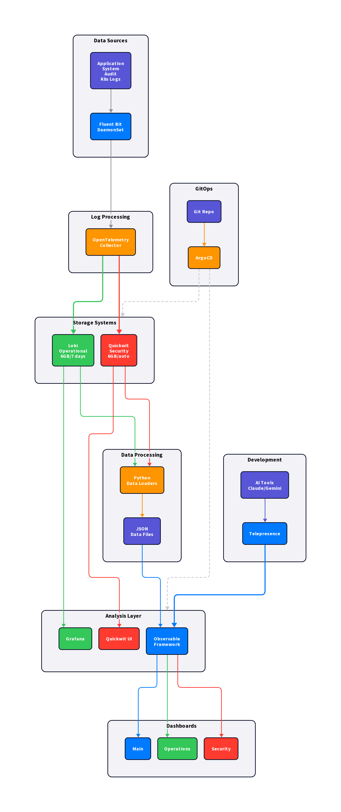
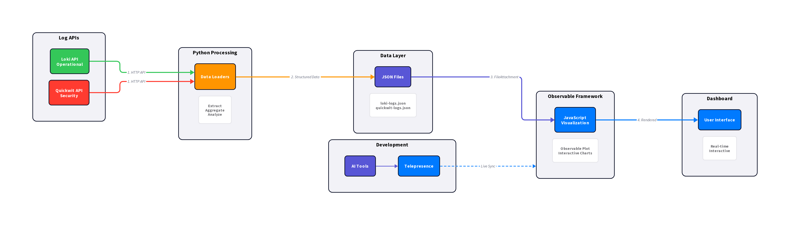

# System Architecture Documentation

## Overview

This observability stack implements a **hybrid architecture** combining Python data processing with JavaScript visualization, all running on Kubernetes with GitOps automation.

## Architecture Diagrams

### Complete System Architecture


### Data Flow Architecture  


### AI Development Workflow


## Core Components

### **Data Collection Layer**
- **Fluent Bit DaemonSet** - Kubernetes-native log collection
- **OpenTelemetry Collector** - Central log routing and processing
- **Log Sources** - Applications, system logs, audit trails, Kubernetes events

### **Storage Layer**
- **Loki** - Time-series log aggregation for operational monitoring
  - 6GB storage with 7-day retention
  - Label-based indexing for fast queries
  - LogQL query language
- **Quickwit** - Full-text search for security analysis
  - 6GB storage with automatic cleanup
  - Elasticsearch-compatible API
  - Full-text search capabilities

### **Processing Layer**
- **Python Data Loaders** - Custom data processing and analytics
  - `loki-logs.py` - Operational data extraction and aggregation
  - `quickwit-logs.py` - Security event analysis and threat detection
  - JSON output for visualization layer
- **Observable Framework** - JavaScript visualization and web serving
  - Markdown-based dashboards
  - Observable Plot for interactive charts
  - Hot reload for development

### **Visualization Layer**
- **Grafana** - Operational dashboards and alerting
- **Quickwit UI** - Security log search and investigation
- **Observable Framework** - Custom analytics and executive reporting
- **Interactive Dashboards** - Real-time data visualization

### **GitOps Management**
- **ArgoCD** - Continuous deployment and configuration management
- **Git Repository** - Single source of truth for all configurations
- **Automated Sync** - Infrastructure as code deployment

### **Development Environment**
- **Telepresence** - Local-to-remote development bridge
- **AI Tools Integration** - Claude Code, Gemini CLI support
- **Container Mounting** - Live file synchronization
- **Hot Reload** - Instant feedback loop

## Data Flow

### 1. Log Collection
```
Kubernetes Pods → Fluent Bit → OpenTelemetry Collector
```

### 2. Log Routing
```
OpenTelemetry Collector → Loki (operational)
                       → Quickwit (security)
```

### 3. Data Processing
```
Python Loaders → API Calls → JSON Data Files
```

### 4. Visualization
```
JSON Data → Observable Framework → Interactive Dashboards
```

### 5. Development
```
Local AI Tools → Telepresence → Kubernetes Container → Live Dashboard
```

## Hybrid Architecture Benefits

### **Python Strengths**
- **Data Processing** - pandas, numpy for complex analytics
- **API Integration** - Robust HTTP clients and error handling
- **Scientific Computing** - Statistical analysis, ML integration
- **Flexibility** - Easy to extend with custom algorithms

### **JavaScript Strengths** 
- **Visualization** - Interactive charts, responsive design
- **Web Performance** - Fast rendering, optimized execution
- **User Experience** - Smooth interactions, progressive loading
- **Real-time Updates** - WebSocket support, live data binding

### **Kubernetes Benefits**
- **Scalability** - Horizontal pod autoscaling
- **Reliability** - Self-healing, rolling deployments
- **Resource Management** - CPU/memory limits, requests
- **Service Discovery** - DNS-based service resolution

### **GitOps Benefits**
- **Declarative** - Infrastructure as code
- **Auditable** - Git history tracks all changes
- **Rollback** - Easy reversion via Git
- **Automated** - Continuous deployment pipeline

## Development Workflow

### **Local Development**
1. **Telepresence Intercept** - Route cluster traffic to local machine
2. **File Mounting** - Edit files locally, sync to container
3. **AI Integration** - Use Claude Code/Gemini CLI for assistance
4. **Live Feedback** - See changes immediately in cluster

### **Container Development**
1. **Direct Access** - kubectl exec into running containers
2. **Hot Reload** - Observable Framework auto-refreshes
3. **API Testing** - Direct access to cluster APIs
4. **Debugging** - Full development environment in container

### **Production Deployment**
1. **Git Commit** - Push changes to repository
2. **ArgoCD Sync** - Automatic deployment to cluster
3. **Health Checks** - Automated validation and rollback
4. **Monitoring** - Grafana alerts and dashboards

## Security Architecture

### **Log Routing Strategy**
- **Dual Pipeline** - All logs go to both Loki and Quickwit
- **Security Focus** - Dedicated Quickwit analysis for threats
- **Operational Focus** - Loki for system monitoring and alerts

### **Data Protection**
- **Network Policies** - Kubernetes network segmentation
- **RBAC** - Role-based access control
- **Secrets Management** - Kubernetes secrets for credentials
- **TLS Encryption** - Secure communication between services

### **Threat Detection**
- **Real-time Analysis** - Python data loaders for threat detection
- **Pattern Recognition** - Security event correlation
- **Alert Integration** - Grafana alerts for security events
- **Forensic Analysis** - Quickwit for incident investigation

## Performance Characteristics

### **Data Processing**
- **Loki Query Performance** - Label-based indexing for fast time-range queries
- **Quickwit Search** - Full-text search with sub-second response times
- **Python Processing** - Efficient data aggregation and analytics
- **JavaScript Rendering** - Client-side visualization for responsive UX

### **Resource Usage**
- **Storage** - 6GB each for Loki and Quickwit with automatic cleanup
- **Memory** - Optimized container resource limits
- **CPU** - Efficient log processing with minimal overhead
- **Network** - Compressed log transmission and storage

### **Scalability**
- **Horizontal Scaling** - Add more pods for increased load
- **Storage Scaling** - Persistent volume expansion
- **Development Scaling** - Multiple developers via Telepresence
- **Query Scaling** - Load balancing for API endpoints

## Development Environment Features

### **AI Tool Integration**
- **Claude Code** - VS Code extension for AI-assisted development
- **Gemini CLI** - Command-line AI assistance for data analysis
- **Local Editing** - Full IDE capabilities with live sync
- **Code Generation** - AI-powered dashboard and loader creation

### **Real-time Development**
- **Live Data Access** - Local tools can query cluster APIs
- **Instant Feedback** - Changes appear immediately in dashboards
- **Debugging Support** - Full debugging capabilities for Python and JavaScript
- **Version Control** - Git integration for change tracking

### **Production Parity**
- **Same Data Sources** - Development uses production-like data
- **Same APIs** - Identical endpoints and responses
- **Same Environment** - Kubernetes container environment
- **Same Performance** - Production-like load and response times

## Next Steps

- **[Setup Guide →](setup.md)** - Deploy the complete stack
- **[Development Examples →](examples.md)** - Hands-on tutorials
- **[API Documentation →](api-endpoints.md)** - Data source integration
- **[Troubleshooting →](troubleshooting.md)** - Common issues and solutions